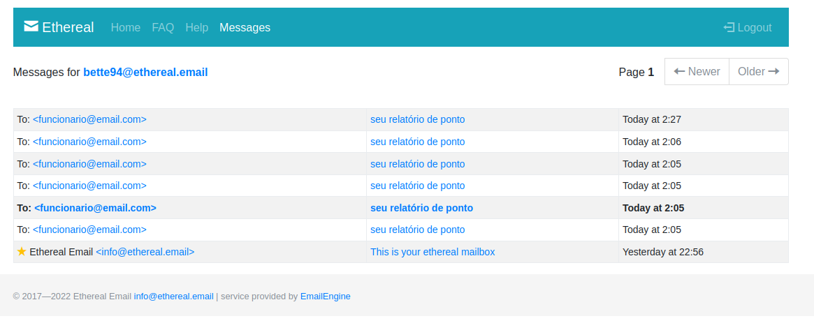

# PROJETO FIAP TECH HACKATHON

Sistema de registro de horário de entrada, intervalos e saída do trabalho dos funcionários.
Este serviço faz parte da implementação do hackathon de conclusão do curso de arquitetura de software da Pós Tech FIAP

Turma II/2023
Membros do grupo 30:
- Diórgenes Eugênio da Silveira - RM 349116
- Elton de Andrade Rodrigues - RM 349353
- Gabriel Mendes - RM 348989
- Juliana Amoasei dos Reis - RM 348666

## Serviço de envio de relatório por email

Este serviço utiliza o recebimento de mensagens via AWS SQS como gatilho para execução de função lambda. A função envia um e-mail para uma caixa de entrada dummy do serviço [ethereal.email](https://ethereal.email).

Os emails são enviados a partir de endereços temporários e podem ser recebidos por endereços mockados:

O conteúdo do email é um relatório de ponto com horas trabalhadas, horas de intervalo e total de horas trabalhadas por dia do mês fechado.

Este serviço faz parte da "fase 1" de implementação do MVP seguindo os requisitos mínimos de entrega.

.png)

## Stack utilizada

* TypeScript
* Node.js v20
* Serverless Framework
* AWS
  * Lambda Functions
  * SQS